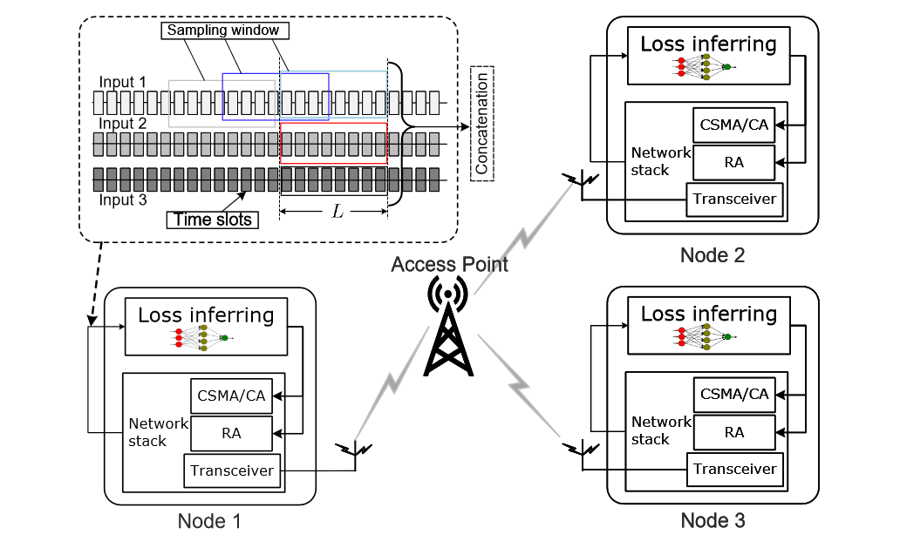
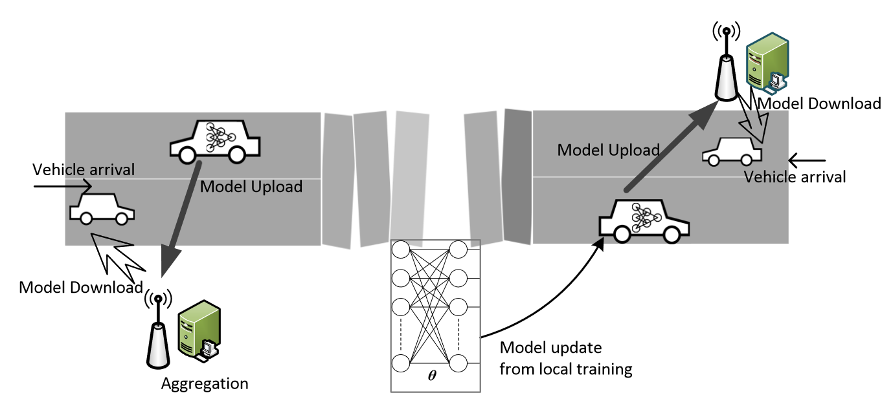
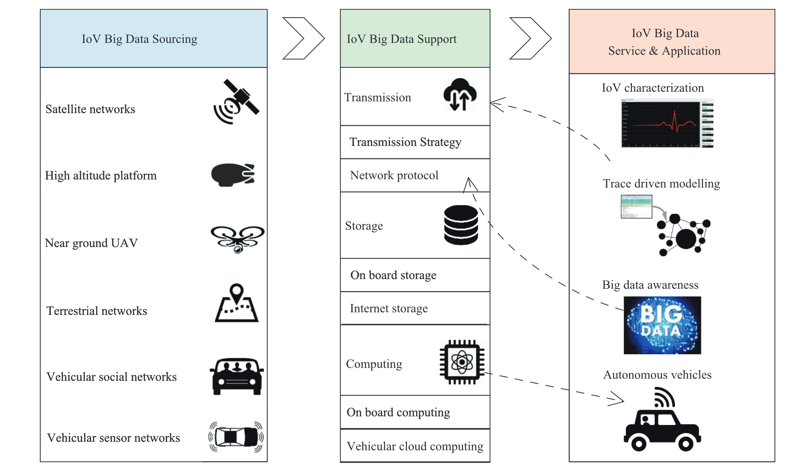
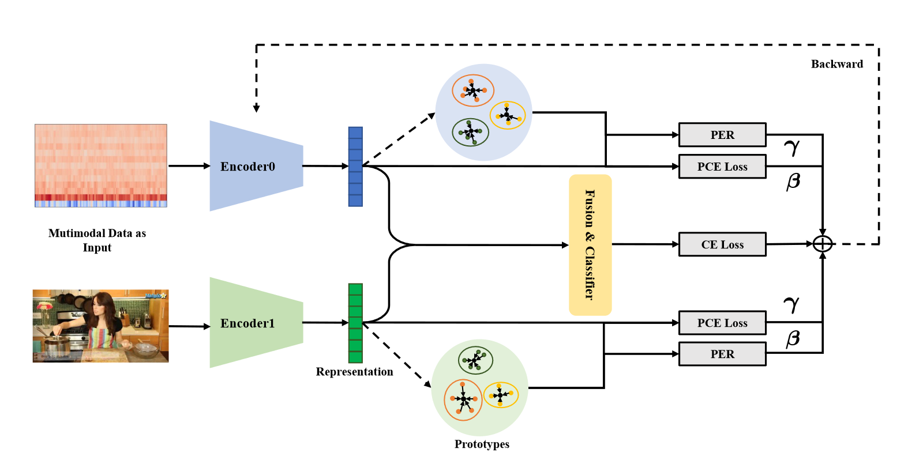
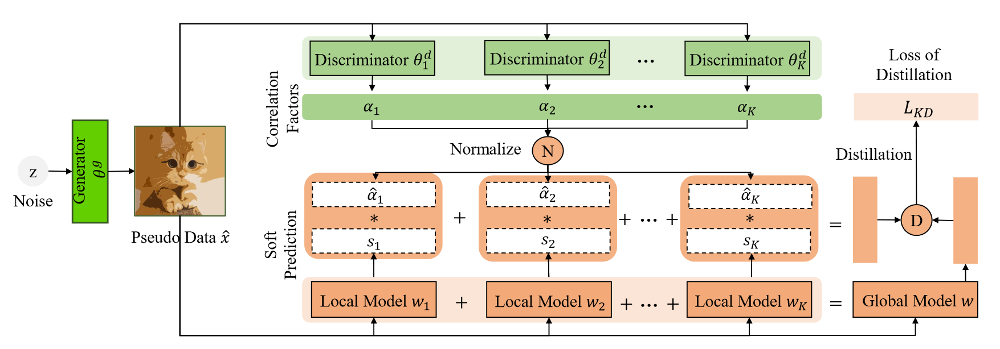







<!-- 
Total Google Scholar Citations: {{ gs_data.citedby }} -->

I am currently a research assistant professor with [Department of Computing](https://www.polyu.edu.hk/comp/) in [the Hong Kong Polytechnic University](https://www.polyu.edu.hk/comp/people/academic-staff/dr-xu-wenchao/). My research areas include **mobile computing**, **AI enabled networking**, **multimodal learning**, **Internet of things**. I have published 80+ papers at the top international journal and conferences with total . 

I received my B.E. and M.E. degrees from Zhejiang University, Hangzhou, China, in 2008 and 2011, supervised by Professor Aiping Huang and Professor [Cunqing Hua](https://english.seiee.sjtu.edu.cn/english/detail/2130_1317.htm). In 2018 I received my Ph.D. degree at the Department of Electrical and Computer Engineering, University of Waterloo under the supervision of Professor [Xuemin(Sherman) Shen](https://uwaterloo.ca/scholar/sshen). 

<!-- <a href='https://scholar.google.com/citations?user=xaTK57QAAAAJ&hl=zh-CN&oi=ao'>google scholar citations <strong></strong></a> -->
# 🔥 News

&nbsp;🎉🎉 We have some **open positions** for **PhD Students**, **Postdoctoral Researcher**, and **Research Assistant** to work and have fun together on multiple research projects. Drop me an email (wenchao.xu@polyu.edu.hk) with your complete CV if you are interested. Candidates with strong backgrounds are preferred. **Visiting Students/Researchers** (onsite/remote) are also welcome!

# 📝 Selected Publications

  

    <a href="https://sigmobile.org/mobicom/2023/accepted.html" target="_blank"  class="custom-link">TMC'23</a>
  

  

[Fast Packet Loss Inferring via Personalized Simulation-Reality Distillation](https://ieeexplore.ieee.org/abstract/document/10138917?casa_token=y8s7T1JqJmgAAAAA:A00d3DOaD0es1lS3I4uXfukHT1IInBTFOSVzNo4T898_E9L9oSlsJZsgUNYZd6cDFHNuAvHHIA), **W. Xu**, H. Wan, H. Wang, N. Cheng, Q. Chen, H. Zhou, S. Guo, **IEEE Transactions on Mobile Computing** 2023

<button class="toggleButton">Abstract</button>
This is the abstract content.

<!--  style='width: 500px; height: 300px;' -->

IEEE T MOBILE COMPUT 2023

[Fast Packet Loss Inferring via Personalized Simulation-Reality Distillation](https://ieeexplore.ieee.org/abstract/document/10138917?casa_token=y8s7T1JqJmgAAAAA:A00d3DOaD0es1lS3I4uXfukHT1IInBTFOSVzNo4T898_E9L9oSlsJZsgUNYZd6cDFHNuAvHHIA), **W. Xu**, H. Wan, H. Wang, N. Cheng, Q. Chen, H. Zhou, S. Guo, **IEEE Transactions on Mobile Computing** 2023

IEEE T MOBILE COMPUT 2023

[Mobile Collaborative Learning over Opportunistic Internet of Vehicles](https://ieeexplore.ieee.org/document/10119206), **W. Xu**, , H. Wang, Z. Lu, C. Hua, N. Cheng, S. Guo, **IEEE Transactions on Mobile Computing** 2023

IEEE-CAA J AUTOMATIC 2017

[Internet of vehicles in big data era](https://ieeexplore.ieee.org/abstract/document/8232587), **W. Xu**, H. Zhou, N. Cheng, F. Lyu, W. Shi, J. Chen, X. Shen **IEEE/CAA Journal of Automatica Sinica (Highly cited paper)** 2017

CVPR 2023

[PMR: Prototypical Modal Rebalance for Multimodal Learning](https://openaccess.thecvf.com/content/CVPR2023/html/Fan_PMR_Prototypical_Modal_Rebalance_for_Multimodal_Learning_CVPR_2023_paper.html), Y. Fan, **W. Xu** H. Wang, J. Wang, S. Guo, **CVPR** 2023

CVPR 2023

[DaFKD: Domain-aware Federated Knowledge Distillation](https://openaccess.thecvf.com/content/CVPR2023/html/Wang_DaFKD_Domain-Aware_Federated_Knowledge_Distillation_CVPR_2023_paper.html), H. Wang, Y. Li, **W. Xu**, R. Li, Y. Zhan, Z. Zeng, **CVPR** 2023

Full publications can refer to [here](./pub.md).

# 🎖 Honors and Awards

- *2023* Best Paper Award, PIMRC.
- *2023* Best Demo Award Winner, ICCC.
- *2020* Nobert Wiener Review Award, IEEE/CAA.
- *2018* Best Paper Award, IEEE Globecom.
- *2018* Ontario Research & Development Challenge Fund Bell Scholarship.

# 📖 Educations

- *2014.09 - 2018.09*, Ph.D., Electrical and Computer Engineering, University of Waterloo, Canada
- *2008.09 - 2011.03*, Master of Engineering, Information and Communication Engineering, Zhejiang University, China.
- *2004.09 - 2008.06*, Bachelor of Engineering, Communications Engineering, Chu Kochen Honors College, Zhejiang University, China.

# 💻 Mentoring

- *2022.09 - now*, Fushuo Huo, Ph.D. student at PolyU, Chief supervisor
- *2022.09 - now*, Jinyu Chen, Ph.D. student at PolyU, Chief supervisor.
- *2022.09 - now*, Yunfeng Fan, Ph.D. student at PolyU, Chief supervisor.
- *2021.09 - now*, Zhaoyi Lu, Remote Ph.D. student at SJTU, Co-supervisor.
- *2021.09 - 2022.09*, Haodong Wan, Research Assistant, at PolyU, Mentoring.
- *2021.09 - 2022.05*, Hao Dong, Research Assistant, at PolyU, Mentoring.

